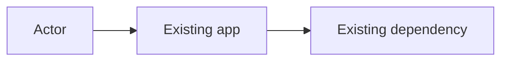
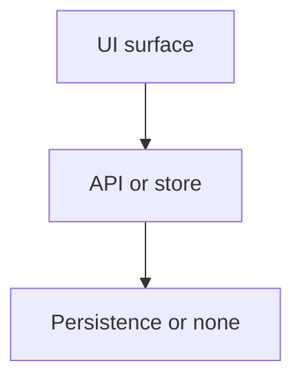
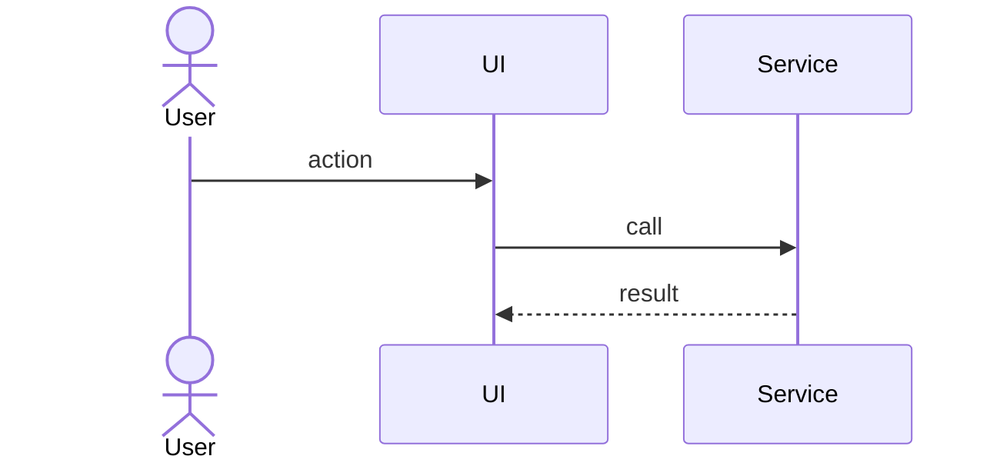

# Architecture — {title}

| Attribute | Value |
|-----------|--------|
| Type | Template |
| Audience | The specialist that writes the artifact |
| Adapt | Fill placeholders only. Do not add a product, host, or customer name. |

**Status:** Draft | Ready for BA
**Slug:** `{slug}`
**Requirements:** `features/{slug}/prd.md` | `features/{slug}/intake.md` | `features/{slug}/epic-plan.md`
**Created:** {YYYY-MM-DD}

---

## 1. Context

Who uses the system and which existing modules this change touches. Cite paths.

## 2. Containers / modules

What we add or change. Prefer existing modules over new ones.

## 3. Sequence (required when a new API or multi-step flow exists)

`none — single-screen local change` is valid when no new API or multi-step flow
exists. Say so.

## 4. ADRs (architecture decisions)

| ID | Decision | Why | Rejected alternative |
|----|----------|-----|----------------------|
| ADR-1 | … | … | … |

## 5. Child-spec split (technical)

If this differs from the PM / intake split, this table **wins** for BA.

| Child slug | Job | Why it is a separate spec |
|------------|-----|---------------------------|
| `{child-a}` | … | … |

## 6. Constraints

- Paths, interfaces, or patterns developers must reuse
- Authz / PII / secrets boundaries
- What must not be invented

## 7. Risks

| Risk | Why it matters | Mitigation |
|------|----------------|------------|
| … | … | … |

## 8. Open questions

none | OQ-1: … (must be empty or cosmetic before Ready)

## 9. Concerns (HITL)

Record technical findings that the signed requirements did not fully settle.
Copy blocking rows into `questions.md` and HANDOFF `BLOCKED` /
`BLOCKED_CHALLENGE_PM`. Recorded rows stay here for `@signoff:architect`.

| ID | Severity | Audience | Concern | Implied change |
|----|----------|----------|---------|----------------|
| none | — | — | none | — |

Severity is `blocking` or `recorded`. Do not mark Ready while a blocking
row remains.
