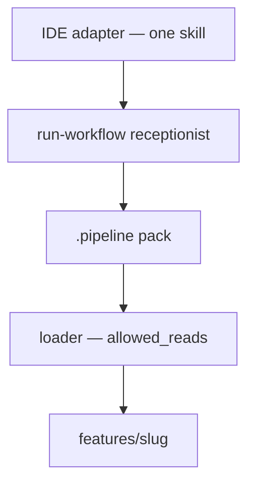

Pipeline Kit is **one product** with **two kits**. You pick one per customer project at `init`. You do not run both in the same repo.

| | **Kit mode** (default) | **Orchestrator mode** |
|--|------------------------|------------------------|
| What it is | The **markdown pack**. Process lives in `.pipeline/` as skills, briefs, workflow JSON, and a loader. | The **Python engine**. Process lives in the installed wheel. Steps are a sealed graph. |
| Who drives a step | The IDE agent via `run-workflow` + the loader allowlist | `pipeline-kit run` (Cursor SDK, or `--runner fake`) |
| `init` flag | `pipeline-kit init --ide cursor` (same as `--mode kit`) | `pipeline-kit init --mode orchestrator --ide cursor` |
| What lands | Full `.pipeline/` (skills, agents, loader, workflows, wiki, hooks, docs) | A slim `.pipeline/` (config, hooks, wiki, docs). No `agents/`, `skills/`, `loader/`, or `workflows/` |
| How you start work | Chat in the IDE. The receptionist picks `ask` / `feature-development` / Jira. | You pass the ask: `--request` or `features/<slug>/request.md`. Chat is not inherited. |
| Extra workflows | Skill + `workflows/{name}.json` + `config.json` | `pipeline_extensions/*.py` or a setuptools entry point |
| Extra install | None | `uv tool install -e ".[orchestrator]"` and `CURSOR_API_KEY` for live runs |

First-party names are the **same** in both kits: `ask`, `feature-development`, `jira-story`, `jira-epic`, `jira-bug`, `test-knowledge-bootstrap`.

:::tip Pick one and stay there
`--mode` is stored on the project. Kit mode never loads `pipeline_extensions/`. Orchestrator mode never runs the markdown loader chain. Do not `init` the other mode on top of an existing project unless you intend to replace how work runs.
:::

## Why there are two

**Kit mode** is the portable operating model: every specialist prompt, allowlist, and policy is a file you can read, overlay, and take to the next customer. The IDE only discovers `run-workflow`. That is what most engagements should use.

**Orchestrator mode** is for teams that want the **same** workflow names driven from code — a sealed graph, HITL gates as CLI (`approve` / `resume`), and associate workflows as Python. The chat session is not the source of the user ask; you pass it on the command line.

Both kits write artifacts to `features/{slug}/`. Both can use the same opt-in add-ons (knowledge, plugins, observability, policy hooks).

## Which one should you use?

| Choose **kit mode** when… | Choose **orchestrator mode** when… |
|---------------------------|------------------------------------|
| Architects will adapt skills, briefs, and `config.json` per customer | You want the chain owned by the wheel, not by markdown files in the app |
| Developers work in Cursor / Claude Code / GitHub chat | You want `pipeline-kit run` / `approve` / `resume` as the control surface |
| You need the loader allowlist (`allowed_reads`) per specialist | You will add associate graphs in `pipeline_extensions/` |
| You do not want a Cursor SDK key | You already install `.[orchestrator]` and set `CURSOR_API_KEY` |

If you are unsure, use **kit mode**. It is the default and the path the customer handbook assumes.

## Kit mode — how a run works



```bash
cd /path/to/your-app
pipeline-kit init --ide cursor
pipeline-kit doctor --ide cursor
pipeline-kit workflows
```

Then open the repo root in the IDE. Product work goes through `run-workflow`. Off-repo trivia must skip the loader.

What you should see on disk: `.pipeline/skills/`, `.pipeline/agents/`, `.pipeline/loader/`, `.pipeline/workflows/`, `config.json`, docs, and policy hooks.

Details: [How it works](/docs/intro/how-it-works), [Add a workflow](/docs/guides/add-workflow).

## Orchestrator mode — how a run works

```mermaid
flowchart TD
  cli["pipeline-kit run --request …"]
  engine["orchestrator engine in the wheel"]
  graph["sealed graph — same workflow names"]
  gate["HITL gate — approve / resume"]
  feat["features/slug"]
  cli --> engine --> graph --> gate --> feat
```

```bash
uv tool install -e ".[orchestrator]"
cd /path/to/your-app
pipeline-kit init --mode orchestrator --ide cursor
# CURSOR_API_KEY from Cursor Dashboard → Integrations
pipeline-kit run --slug checkout-redesign --workflow feature-development \
  --request "redesign checkout so guests can pay without an account"
pipeline-kit approve --slug checkout-redesign --gate requirements
pipeline-kit resume --slug checkout-redesign
```

`--request` is the user ask. `--slug` is only the folder name under `features/`. `--runner fake` and `--dry-run` do not call the SDK.

Associates add workflows with `pipeline-kit workflows --scaffold NAME`, or copy the examples from `extensions/orchestrator/` in the kit clone.

CLI: [Orchestrator commands](/docs/reference/cli#orchestrator-mode). Examples: [Extensions](/docs/capabilities/extensions).

## What both kits share

- First-party workflow **names**
- `features/{slug}/` run artifacts
- `.pipeline/config.json` overlay (verify, deploy, flags)
- Policy hooks in `.pipeline/hooks/` (merged on `init --ide cursor` / `claude-code`)
- Opt-in knowledge, plugins, and `obs install`

## What they do not share

| | Kit | Orchestrator |
|--|-----|--------------|
| Markdown skills / agent briefs | Yes — copied into `.pipeline/` | No — briefs stay in the wheel |
| Loader / `allowed_reads` | Yes | No |
| `pipeline_extensions/` | Never loaded | Loaded from the app (or entry points) |
| `pipeline-kit run` / `approve` / `resume` | Not used | The control surface |

## Next

- [First project](/docs/getting-started/first-project) — what lands on disk in each kit
- [Extensions](/docs/capabilities/extensions) — add a process without forking
- [CLI reference](/docs/reference/cli)
- [Repository layout](/docs/intro/repo-layout) — where each kit lives in this repo
