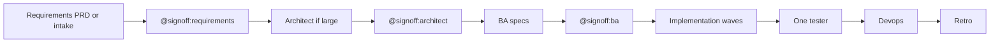

Feature-class delivery has **three planning gates** the user signs in order. Config key `gates.require_planning_signoff_before_build` keeps developers from starting early.

## Order

1. PM or intake writes the requirements artifact. Parent stops for `@signoff:requirements`.
2. Parent applies `architect-policy.md` (or `RUN_ARCHITECT`). Large stories run Architect. Micro, minor, and `jira-bug` skip Architect.
3. Architect writes mermaid architecture + implementation plan. Optional Archify HTML is extra; mermaid stays required.
4. Parent stops for `@signoff:architect` (skipped when `skip_architect`).
5. BA writes nested `features/{slug}/{child}/specification.md`, `spec-order.md`, test plan. BA critic, then `@signoff:ba`.
6. Waves: per child, developer then developer-critic. Telemetry only if `RUN_TELEMETRY`.
7. One tester at the parent slug. Devops only after `qa-signoff.md` has `FEATURE_SIGNOFF: passed`.
8. Retro is the last step (`gates.complete_after`).

## Clarify-first

PM, Architect, and BA read prior `features/{slug}/` artifacts (`decisions.md`, plan, architecture) **before** asking. They ask remaining checklist items instead of silent defaults. Do not re-ask a decision already in `decisions.md`.

## Do not

- Auto-continue after PM, Architect, or BA SUCCESS
- Spawn Architect or BA before `signoff-requirements.md`
- Start waves before `signoff-ba.md` on feature class
- Run tester per child, or between waves
- Put sibling slugs at `features/` instead of `features/{feature}/{child}/`

Machine contract for the next Task is JSON on disk, not a pasted HANDOFF. See [slim handoffs](/docs/troubleshooting/slim-handoffs).
