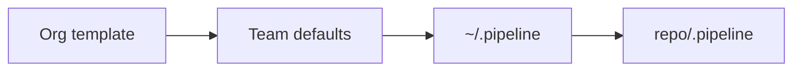

Pipeline Kit has two runtime scopes. Artifacts always land in the **current** repository’s `features/`, never in `$HOME`.

## Project pack (usual)

```bash
cd /path/to/your-app
pipeline-kit init --ide cursor
```

| What | Where |
|------|--------|
| Pack | `<repo>/.pipeline` |
| IDE skill | `<repo>/.cursor/skills/run-workflow` (or `.claude` / `.github`) |

Use this when the engagement owns its overlay (`config.json`, deploy script, Jira on/off).

## User pack (laptop default)

```bash
pipeline-kit setup --ide cursor
```

| What | Where |
|------|--------|
| Pack | `~/.pipeline` |
| IDE skill | `~/.cursor/skills/run-workflow` when `--ide cursor` |

Use this so every repo on that laptop can see `run-workflow` even without a project pack. The moment a repo has its own `.pipeline`, **that** pack wins.

## Resolution at run time

1. Walk up from the current project for `.pipeline/config.json` or `.pipeline/workflows/`.
2. If none, use `~/.pipeline`.
3. A project pack **always wins**.
4. `features/{slug}/` is always written in the **current project**.
5. Active allowlist state is `{pack}/state/active-context.json`.



Org-wide defaults are guidance: copy or seed a pack, then let project overlay win. Do not bake org URLs into the shared tree.

## Refresh vs uninstall

| Command | Effect |
|---------|--------|
| `pipeline-kit update [project]` | Refresh managed files, keep local `config.json` values |
| `pipeline-kit update --user` | Refresh `~/.pipeline` |
| `pipeline-kit uninstall [project]` | Remove managed project files |
| `pipeline-kit uninstall --user` | Remove managed user files |
