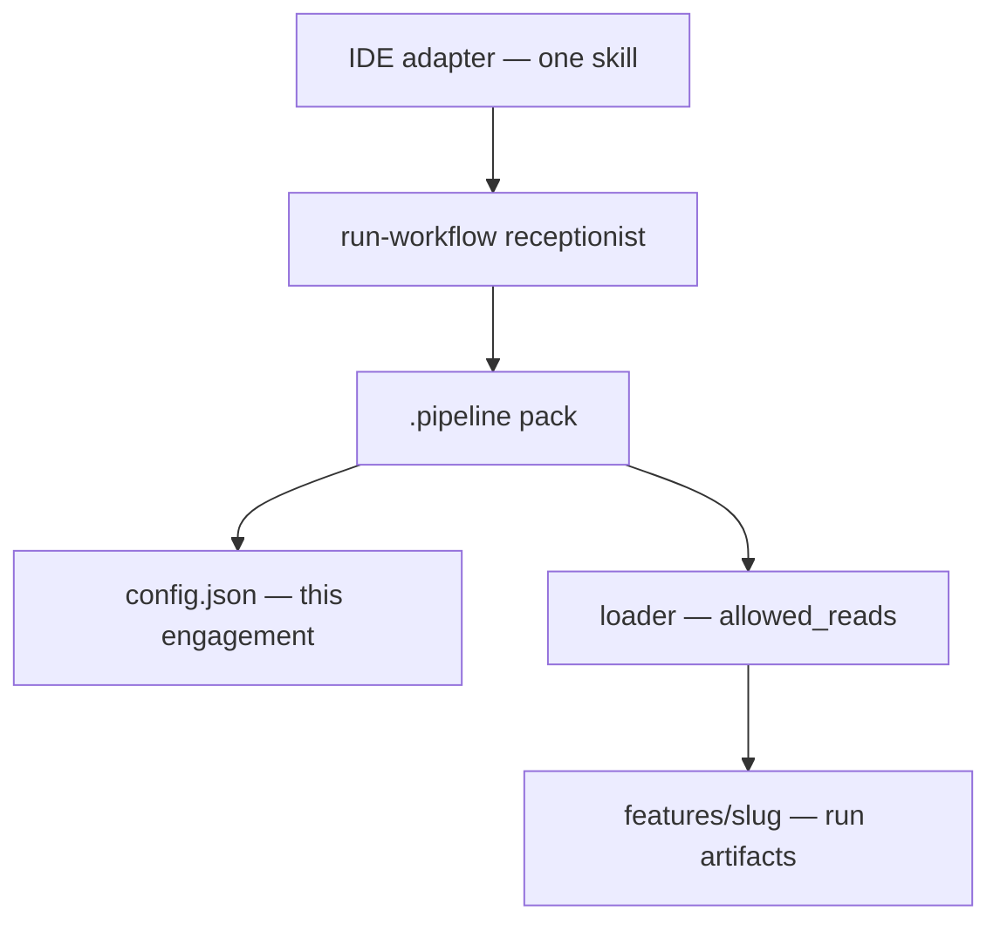

## Portable pack, thin IDE

All process files sit in `.pipeline/`. The IDE folder holds **only** `run-workflow` (and optional hooks). Cursor, Claude Code, and GitHub each get the same pack; only the adapter path changes (`--ide cursor` | `claude-code` | `github` | `none`).

## Workflow as the unit of scale

A workflow is a named procedure (`ask`, `feature-development`, `jira-bug`, …) with a chain and a file allowlist. Adding a customer-specific process means adding a workflow — not cloning the kit.

## Allowlist per step

The loader writes `allowed_reads` for the current specialist. BA does not ingest the deploy runbook; the developer does not ingest Jira intake. That is what keeps a large pack cheap enough to reuse across accounts.

## Config is the engagement overlay

Chains, tracker on/off, path-based verify reminders, and deploy target names live in `.pipeline/config.json`. Skills stay free of customer folder names and site URLs. The next account changes config (and the local-deploy script), not the orchestration skill.

## Install scopes

`--project` (`init`) materializes `<repo>/.pipeline`. `--user` (`setup`) materializes `~/.pipeline`. At runtime the project pack wins; otherwise the user pack is used. Artifacts always land in the **current** repo’s `features/`.

Architects can later layer org template → user → project without changing the runtime model:

```text
org template  →  team defaults  →  ~/.pipeline  →  <repo>/.pipeline (wins)
```

## Receptionist, not a monolith

`AGENTS.md` stays a routing table. The agent does not load the pack until `run-workflow` runs the loader. Trivia and off-repo asks skip the pipeline entirely.

## Next

- [Who it is for](/docs/intro/who-it-is-for)
- [Loader and allowlists](/docs/capabilities/loader)
- [Install the CLI](/docs/getting-started/install-cli)
